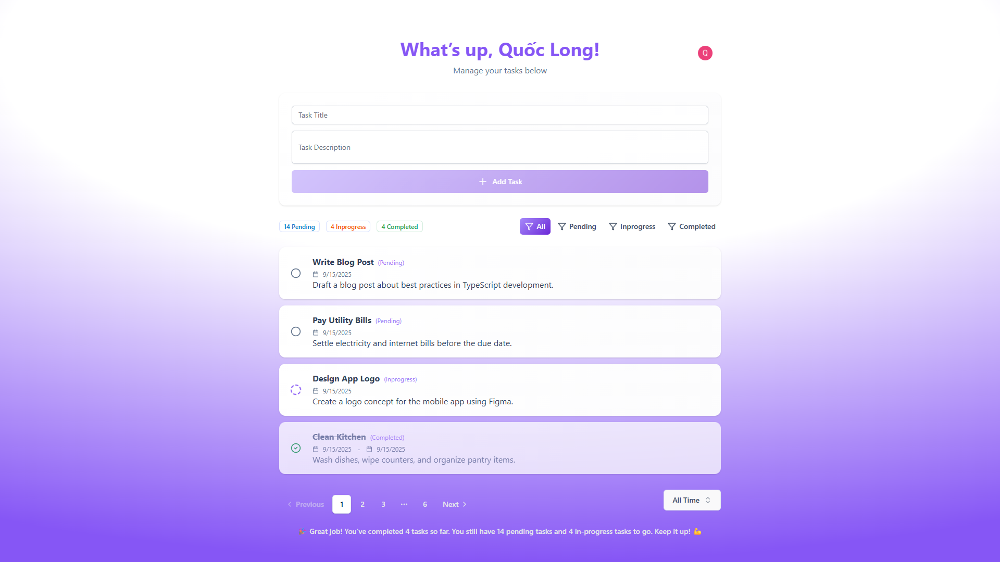

# To-Do App Frontend

Đây là mã nguồn giao diện của ứng dụng To-Do. Ứng dụng được xây dựng bằng React/Vite, sử dụng Clerk để đăng nhập và kết nối với backend ở thư mục `../todo-list-backend` nhằm quản lý dữ liệu tác vụ.



## Mục lục

- Tổng quan
- Tính năng
- Công nghệ
- Cấu trúc thư mục
- Biến môi trường
- Hướng dẫn cài đặt
- Các lệnh npm
- Làm việc với backend
- Triển khai
- Tài liệu liên quan

## Tổng quan

Frontend dùng React 19 và TypeScript, biên dịch qua Vite. Giao diện áp dụng Tailwind CSS kết hợp các thành phần xây dựng trên Radix UI. Mọi request tới API được thực hiện qua Axios và tự động đính kèm token Clerk.

## Tính năng

- Hỗ trợ đăng nhập/đăng ký/quên phiên bằng Clerk thông qua React Router.
- CRUD tác vụ (tạo, cập nhật trạng thái, xóa) với làm mới danh sách sau khi thao tác.
- Bộ lọc thời gian (today, this_week, this_month, all_time) và bộ lọc trạng thái (pending, inprogress, completed).
- Phân trang danh sách tác vụ với giới hạn cấu hình `visibleTaskLimit`.
- Footer thay đổi thông điệp động dựa trên số tác vụ hoàn thành.
- Toast thông báo trạng thái thao tác bằng thư viện Sonner.

## Công nghệ

- React 19, React Router 7
- TypeScript 5
- Vite 7
- Tailwind CSS 4
- Clerk React SDK
- Axios
- Radix UI và các thành phần UI tuỳ biến

## Cấu trúc thư mục

```
src/
  api/api.ts           // Cấu hình Axios với baseURL và headers
  components/          // Thành phần UI tái sử dụng (AddTask, Header, ...)
  hooks/               // Sẵn sàng cho custom hooks
  lib/data.ts          // Kiểu dữ liệu, hằng số, cấu hình phân trang
  pages/               // Trang tuyến (Home, Sign-in, Sign-up, NotFound)
  main.tsx             // Khởi tạo ứng dụng React
  App.tsx              // Định nghĩa router
public/
  ...                  // Tài nguyên tĩnh
```

## Biến môi trường

Tạo file `.env` trong thư mục dự án với các khóa:

| Tên | Bắt buộc | Mô tả |
| --- | --- | --- |
| `VITE_API_BASE_URL` | Có | URL backend, ví dụ `http://localhost:3000/api`. |
| `VITE_CLERK_PUBLISHABLE_KEY` | Có | Publishable key của Clerk cho frontend. |
| `VITE_CLERK_SIGN_IN_URL` | Không | Đường dẫn trang đăng nhập tùy chỉnh, mặc định `/sign-in`. |
| `VITE_CLERK_SIGN_UP_URL` | Không | Đường dẫn trang đăng ký tùy chỉnh, mặc định `/sign-up`. |

> Không commit file `.env` lên repository. Hãy tạo `.env.example` nếu muốn chia sẻ cấu hình mẫu.

## Hướng dẫn cài đặt

1. Cài đặt phụ thuộc:
   ```powershell
   cd todo-list-frontend
   npm install
   ```
2. Tạo ứng dụng trên [Clerk Dashboard](https://clerk.com/) và lấy publishable key.
3. Đảm bảo backend đang chạy và cung cấp URL, xem `../todo-list-backend/README.md`.
4. Khai báo biến môi trường trong `.env`.
5. Chạy chế độ phát triển:
   ```powershell
   npm run dev
   ```
   Ứng dụng mặc định mở tại `http://localhost:5173`.

## Các lệnh npm

| Lệnh | Mô tả |
| --- | --- |
| `npm run dev` | Chạy Vite với HMR cho môi trường phát triển. |
| `npm run build` | Kiểm tra kiểu và build sản phẩm vào thư mục `dist/`. |
| `npm run preview` | Chạy thử bản build tĩnh trên máy local. |
| `npm run lint` | Kiểm tra chất lượng mã với ESLint. |

## Làm việc với backend

- Tất cả lời gọi API được định nghĩa tại `src/api/api.ts`. Chỉ cần đổi `VITE_API_BASE_URL` để trỏ tới môi trường khác.
- Axios instance tự động thêm header `Authorization` với token do Clerk cấp.
- Backend mặc định phục vụ các tuyến dưới `/api/tasks`. Khi chạy bằng `npx vercel dev`, URL gợi ý là `http://localhost:3000/api`.
- Nếu mở rộng API, hãy bổ sung hàm helper tại thư mục `src/api` để giữ logic component gọn nhẹ.

## Triển khai

- Chạy `npm run build` để sinh thư mục `dist/` và triển khai lên Vercel, Netlify hoặc bất kỳ dịch vụ hosting tĩnh nào.
- Thiết lập biến môi trường tiền tố `VITE_` trên nền tảng triển khai để cấu hình Clerk và API.
- Đảm bảo backend cho phép CORS từ domain sản phẩm.

## Tài liệu liên quan

- Backend: [../todo-list-backend/README.md](../todo-list-backend/README.md)
- Tài liệu tiếng Anh: [README.md](README.md)
